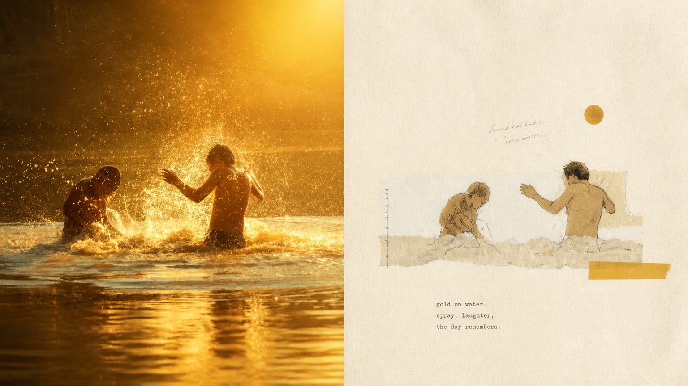
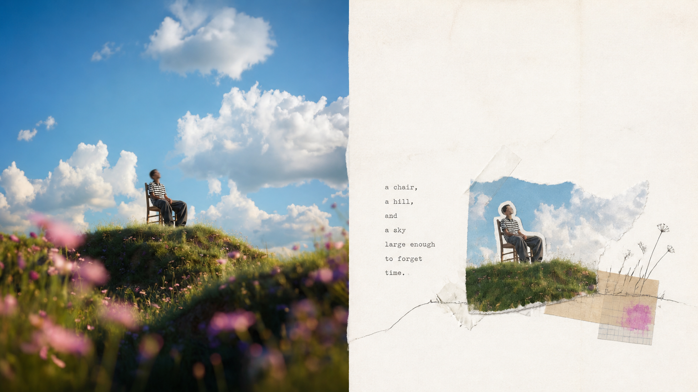
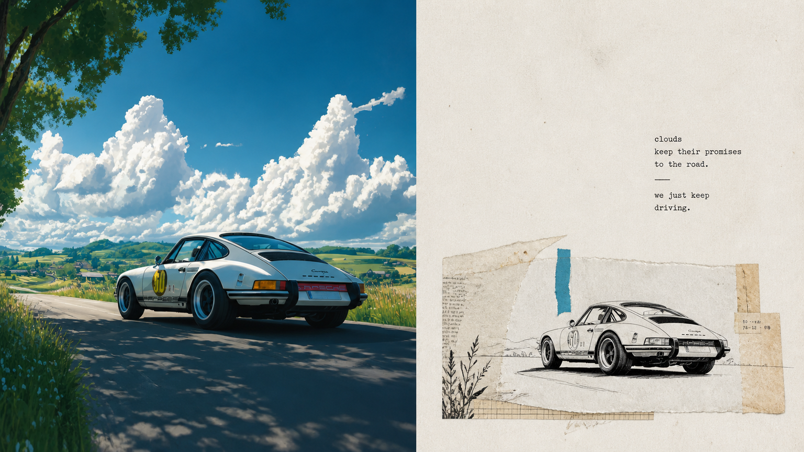
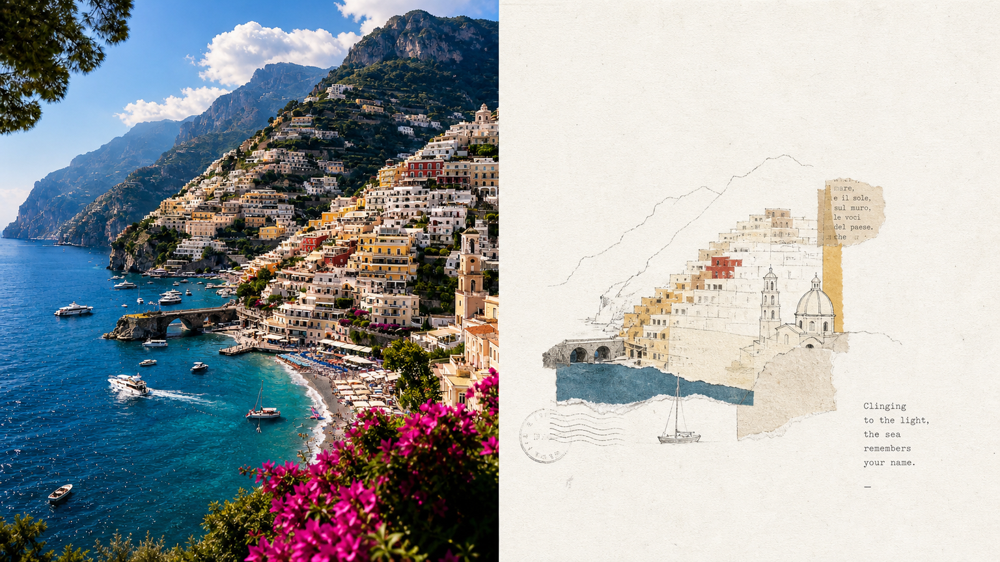
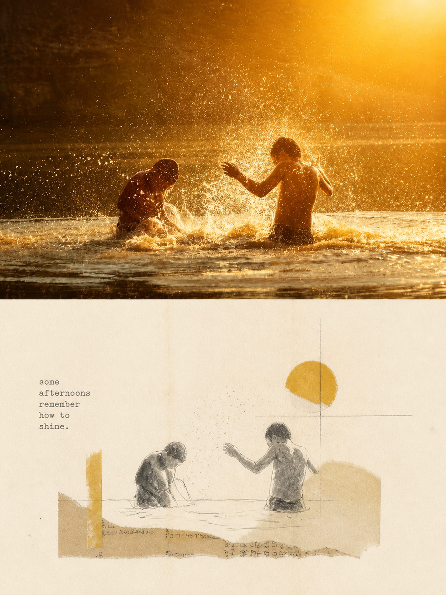
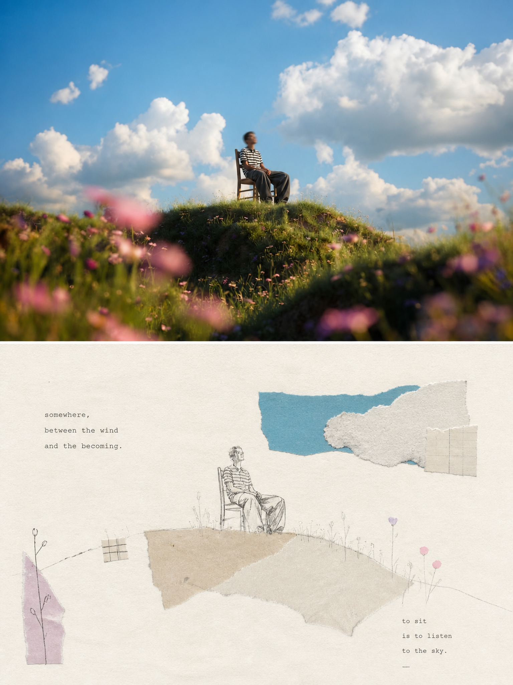
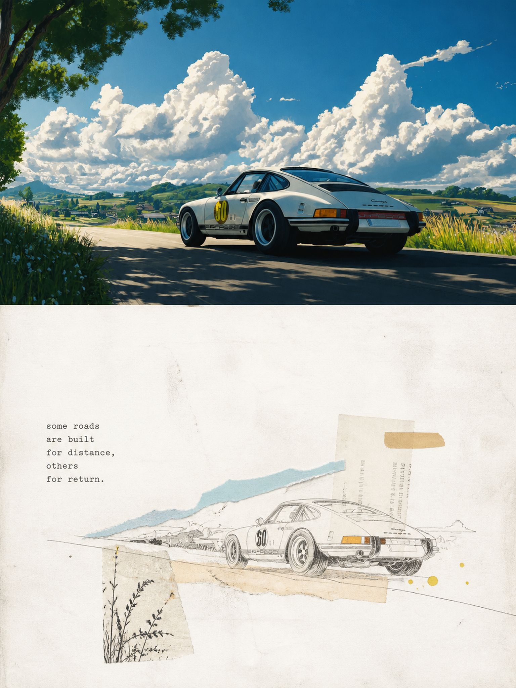
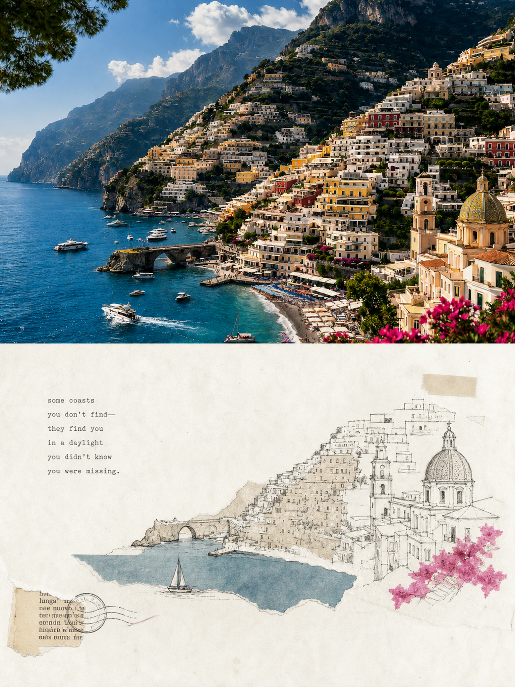

# 🦁 XXD Panel 064

### 把照片变成安静、残缺而富有时间感的旧纸拼贴档案

Panel 064 使用手撕纸边、旧纸纹理、铅笔或墨线、淡化文字残片和极少量源图强调色，让留白承担空气、时间、沉默与记忆。

**关键词：** 旧纸拼贴 · 手撕边缘 · 档案感 · 打字机小字 · 诗性留白

## 使用

```text
/xxd-panel-064 photo.jpg --mode design-only --size 3:4 --text prompt --locale zh-CN
```

支持单图、目录批量、四种输出模式、多尺寸与三种文字模式。完整行为见 [SKILL.md](SKILL.md)。

## 提示词权威

[简体中文原始提示词](references/original-prompt/zh-CN.md)是运行时唯一创作与审美权威。原始 X 样张位暂留；新增样张来源见[样张清单](assets/examples/README.md)。

## 新增 16:9 左右双联样张

| | |
|---|---|
|  |  |
|  |  |

## 新增 3:4 上下双联样张

| | |
|---|---|
|  |  |
|  |  |
